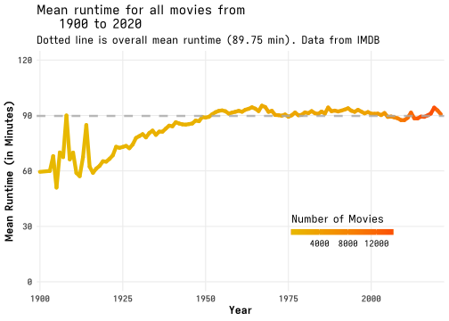
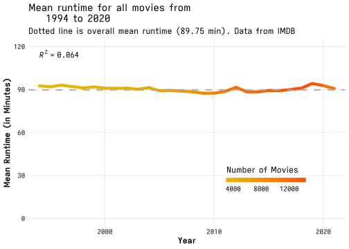
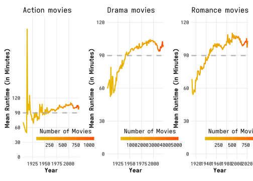
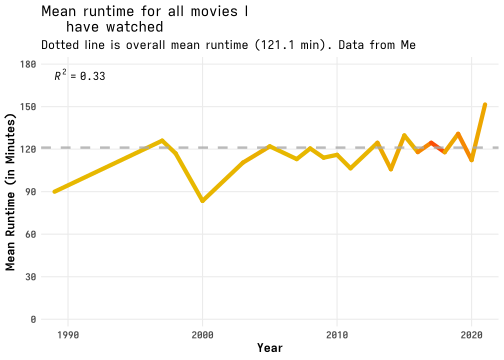

Investigating IMDB Runtime
================
Luke Hannan
30 April, 2022

-   [Setup](#setup)
-   [Background](#background)
    -   [Data Sources](#data-sources)
-   [Data Processing](#data-processing)
-   [Overall Movies](#overall-movies)
-   [Per Genre](#per-genre)
-   [Movies I Watched](#movies-i-watched)
-   [Conclusion](#conclusion)
-   [Compute Environment](#compute-environment)

# Setup

``` r
library("knitr")
knitr::opts_knit$set(dev = "svg", dev.args = list(type = "cairo", bg = "transparent"))
knitr::opts_chunk$set(dev = "svg", dev.args = list(bg = "transparent"), dpi = 300, warning = FALSE)

library("data.table")
library("parallel")
# for string manipulation
library("stringr")
# for plotting
library("ggplot2")
# for making better looking default ggplot themes
library("ggthemes")
# for more ggplot2 colour schemes
library("colorspace")
# for arranging facet plots
library("cowplot")
# for extra publication related things
library("ggpubr")
# lollipop plots; Author: https://github.com/hrbrmstr
# I just can't install the proj package so I cant install ggalt which has the code for lollipop plots
# so I have just copied that specific geom
source("utils/geom_lollipop.r")
```

# Background

I enjoy watching movies of all sorts, but the past couple of years I
have found myself saying **“I enjoyed the movie, but I would have
enjoyed it more if they cut a bit of stuff out”** quite a lot. I felt
like the average runtime of movies had increased over the years. So I
did what any reasonable person would do and looked at the data.

## Data Sources

All data was retrieved from IMDB website on 30-04-2022.

<https://datasets.imdbws.com/>

Data Documentation: <http://www.imdb.com/interfaces/>

**title.basics.tsv.gz - Contains the following information for
titles:**  
tconst (string) - alphanumeric unique identifier of the title  
titleType (string) – the type/format of the title (e.g. movie, short,
tvseries, tvepisode, video, etc)  
primaryTitle (string) – the more popular title / the title used by the
filmmakers on promotional materials at the point of release  
originalTitle (string) - original title, in the original language  
isAdult (boolean) - 0: non-adult title; 1: adult title  
startYear (YYYY) – represents the release year of a title. In the case
of TV Series, it is the series start year  
endYear (YYYY) – TV Series end year. ‘’ for all other title types  
runtimeMinutes – primary runtime of the title, in minutes  
genres (string array) – includes up to three genres associated with the
title  

# Data Processing

``` r
# we check if the datafile exists if it does we carry on if it doesn't we download it
# link for the datafiles: https://datasets.imdbws.com/title.basics.tsv.gz
# I don't include it automatically because I don't want to track changes on the dataset or store it in the repo
# If you want to rerun this document first download the data

# The title.basics.tsv.gz file contains the runtime, title, and year of release' exactly what we are looking for
movies = fread("data/title.basics.tsv.gz", sep = '\t', nThread = detectCores(), na.strings = c(",,", "\\N"))

# convert runtime to numeric
movies[, runtimeMinutes := as.numeric(runtimeMinutes)]
movies[, startYear := as.numeric(startYear)]

# Then only include movies that have runtimes
movies = subset(movies, titleType == "movie" & !is.na(runtimeMinutes) & !is.na(startYear))
# 367 883 movies that have runtimes
nrow(movies)
```

    ## [1] 377305

``` r
# First let us see the range of years we have to work with
summary(movies$startYear, na.rm = TRUE)
```

    ##    Min. 1st Qu.  Median    Mean 3rd Qu.    Max. 
    ##    1896    1978    2005    1994    2015    2027

``` r
summary(movies$runtimeMinutes, na.rm = TRUE)
```

    ##    Min. 1st Qu.  Median    Mean 3rd Qu.    Max. 
    ##       1      74      89      90     100   51420

``` r
hist(movies$runtimeMinutes)
```

<!-- -->

``` r
# some strange runtime and year values we will have to investigate and remove

# lets see these movies with strange runtimes
movies[runtimeMinutes >= 1000, ]
```

    ##         tconst titleType                                    primaryTitle
    ##  1:  tt0004052     movie                            The Hazards of Helen
    ##  2:  tt0179184     movie                                            ****
    ##  3:  tt0245532     movie                  Unter der schwarzen Sturmfahne
    ##  4:  tt0253982     movie               Zimmermädchen... Dreimal klingeln
    ##  5:  tt0284020     movie                           The Cure for Insomnia
    ##  6:  tt0342707     movie The Longest Most Meaningless Movie in the World
    ##  7:  tt0387271     movie                                 A Twist of Fate
    ##  8:  tt0821950     movie                                   A Mosca cieca
    ##  9: tt10844900     movie                                              Qw
    ## 10: tt10958742     movie                                 Five-Year Diary
    ## 11: tt11765010     movie                                      Super Nova
    ##                                       originalTitle isAdult startYear endYear
    ##  1:                            The Hazards of Helen       0      1914      NA
    ##  2:                                            ****       0      1967      NA
    ##  3:                  Unter der schwarzen Sturmfahne       0      1933      NA
    ##  4:               Zimmermädchen... Dreimal klingeln       0      1934      NA
    ##  5:                           The Cure for Insomnia       0      1987      NA
    ##  6: The Longest Most Meaningless Movie in the World       0      1970      NA
    ##  7:                           Hanmanheun namilsaeng       0      1970      NA
    ##  8:                                   A Mosca cieca       0      1921      NA
    ##  9:                                              Qw       0      2019      NA
    ## 10:                                 Five-Year Diary       0      1982      NA
    ## 11:                                      Super Nova       0      2020      NA
    ##     runtimeMinutes                    genres
    ##  1:           1428                    Action
    ##  2:           1500                     Drama
    ##  3:           3122                   History
    ##  4:           2382                     Drama
    ##  5:           5220         Documentary,Music
    ##  6:           2880 Documentary,Drama,History
    ##  7:           1970                     Drama
    ##  8:           1035                     Drama
    ##  9:          10062                     Drama
    ## 10:           2160               Documentary
    ## 11:           1325                     Drama
    ##  [ reached getOption("max.print") -- omitted 30 rows ]

``` r
# I'm not interested in any movies that have not been released so any movie that has a startYear after 2021
# for now lets keep these runtimeMinutes outliers in, they wont change much and can always remove them later
movies = subset(movies, startYear <= 2021 & startYear >= 1900)
```

# Overall Movies

Below is a plot of the average run time for all movies in the database
from the year 1900 to the year 2020.

``` r
ggplot(aes(x = startYear, y = mean_runtime, colour = n), data = movies[, .(mean_runtime = mean(runtimeMinutes), n = .N), by = startYear]) +
  geom_line(size = 2, lineend = "round", linejoin = "mitre") +
  geom_hline(alpha = 0.8, yintercept = 89.75, linetype = 2, size = 1.15, color = "darkgrey") +
  scale_y_continuous(limits = c(0, 120), breaks = c(0, 30, 60, 90, 120), expand = c(0, 5)) +
  scale_x_continuous(expand = c(0, 1)) +
  scale_colour_gradient(
    low = "#E7B800", high = "#FC4E07", breaks = c(0, 4000, 8000, 12000),
    guide = guide_colorbar(title.position = "top", title.hjust = 0.05, nbin = 500, barheight = 0.45, barwidth = 8,
    raster = TRUE)
  ) +
  labs(
    x = "Year", y = "Mean Runtime (in Minutes)", colour = "Number of Movies", title = "Mean runtime for all movies from
    1900 to 2020", subtitle = "Dotted line is overall mean runtime (89.75 min). Data from IMDB"
    ) +
  theme_minimal() +
  theme(
    legend.position = c(0.75, 0.25),
    legend.direction = "horizontal",
    panel.grid.minor = element_blank(),
    text = element_text(size = 12),
    axis.title.x = element_text(size = 12, face = "bold"),
    axis.title.y = element_text(size = 12, face = "bold"),
    axis.text.y = element_text(face = "bold"),
    axis.text.x = element_text(face = "bold")
  )
```



Lets zoom in real quick and only look at movies that have been released
since I was born. Interestingly enough the line seems completely flat,
lets throw in a pearsons correlation coefficient to see how flat it is.

``` r
ggplot(aes(x = startYear, y = mean_runtime, colour = n), data = movies[startYear >= 1994, .(mean_runtime = mean(runtimeMinutes), n = .N), by = startYear]) +
  geom_line(size = 2, lineend = "round", linejoin = "mitre") +
  geom_hline(alpha = 0.8, yintercept = 89.75, linetype = 2, size = 1.15, color = "darkgrey") +
  scale_y_continuous(limits = c(0, 120), breaks = c(0, 30, 60, 90, 120), expand = c(0, 5)) +
  scale_x_continuous(expand = c(0, 1)) +
  scale_colour_gradient(
    low = "#E7B800", high = "#FC4E07", breaks = c(0, 4000, 8000, 12000), guide = guide_colorbar(title.position = "top",
    title.hjust = 0.05, nbin = 500, barheight = 0.45, barwidth = 8, raster = TRUE)
  ) +
  labs(
    x = "Year", y = "Mean Runtime (in Minutes)", colour = "Number of Movies", title = "Mean runtime for all movies from
    1994 to 2020", subtitle = "Dotted line is overall mean runtime (89.75 min). Data from IMDB"
  ) +
  theme_minimal() +
  theme(
    legend.position = c(0.75, 0.25),
    legend.direction = "horizontal",
    panel.grid.minor = element_blank(),
    text = element_text(size = 12),
    axis.title.x = element_text(size = 12, face = "bold"),
    axis.title.y = element_text(size = 12, face = "bold"),
    axis.text.y = element_text(face = "bold"),
    axis.text.x = element_text(face = "bold")
  ) + stat_cor(aes(label = paste(..rr.label..)))
```



# Per Genre

Now we produce the same plot as the overall plot above but for each
genre in the dataset.

``` r
# The same plot but now for action movies
action = ggplot(aes(x = startYear, y = mean_runtime, colour = n), data = movies[grepl("action", tolower(genres)), .(mean_runtime = mean(runtimeMinutes), n = .N), by = startYear]) +
  geom_line(na.rm = TRUE, size = 1, lineend = "round", linejoin = "mitre") +
  geom_hline(alpha = 0.8, yintercept = 89.75, linetype = 2, size = 1.15, color = "darkgrey") +
  scale_y_continuous(limits = c(0, 280), breaks = c(0, 30, 60, 90, 120), expand = c(0, 5)) +
  scale_x_continuous(expand = c(0, 1)) +
  scale_colour_gradient(
    low = "#E7B800", high = "#FC4E07",
    guide = guide_colorbar(title.position = "top", title.hjust = 0.55, nbin = 500, barheight = 0.45, barwidth = 8,
    raster = TRUE)
  ) +
  labs(x = "Year", y = "Mean Runtime (in Minutes)", colour = "Number of Movies", title = "Action movies") +
  theme_minimal() +
  theme(
    legend.position = c(0.75, 0.15),
    legend.direction = "horizontal",
    panel.grid.minor = element_blank(),
    text = element_text(size = 12),
    axis.title.x = element_text(size = 12, face = "bold"),
    axis.title.y = element_text(size = 12, face = "bold"),
    axis.text.y = element_text(face = "bold"),
    axis.text.x = element_text(face = "bold")
  )


# The same plot but now for romance movies
romance = ggplot(aes(x = startYear, y = mean_runtime, colour = n), data = movies[grepl("romance", tolower(genres)), .(mean_runtime = mean(runtimeMinutes), n = .N), by = startYear]) +
  geom_line(na.rm = TRUE, size = 1, lineend = "round", linejoin = "mitre") +
  geom_hline(alpha = 0.8, yintercept = 89.75, linetype = 2, size = 1.15, color = "darkgrey") +
  scale_y_continuous(limits = c(0, 120), breaks = c(0, 30, 60, 90, 120), expand = c(0, 5)) +
  scale_x_continuous(expand = c(0, 1)) +
  scale_colour_gradient(
    low = "#E7B800", high = "#FC4E07", guide = guide_colorbar(title.position = "top", title.hjust = 0.55, nbin = 500,
    barheight = 0.45, barwidth = 8, raster = TRUE)
  ) +
  labs(x = "Year", y = "Mean Runtime (in Minutes)", colour = "Number of Movies", title = "Romance movies") +
  theme_minimal() +
  theme(
    legend.position = c(0.75, 0.15),
    legend.direction = "horizontal",
    panel.grid.minor = element_blank(),
    text = element_text(size = 12),
    axis.title.x = element_text(size = 12, face = "bold"),
    axis.title.y = element_text(size = 12, face = "bold"),
    axis.text.y = element_text(face = "bold"),
    axis.text.x = element_text(face = "bold")
  )

# The same plot but now for drama movies
drama = ggplot(aes(x = startYear, y = mean_runtime, colour = n), data = movies[grepl("drama", tolower(genres)), .(mean_runtime = mean(runtimeMinutes), n = .N), by = startYear]) +
  geom_line(na.rm = TRUE, size = 1, lineend = "round", linejoin = "mitre") +
  geom_hline(alpha = 0.8, yintercept = 89.75, linetype = 2, size = 1.15, color = "darkgrey") +
  scale_y_continuous(limits = c(0, 120), breaks = c(0, 30, 60, 90, 120), expand = c(0, 5)) +
  scale_x_continuous(expand = c(0, 1)) +
  scale_colour_gradient(
    low = "#E7B800", high = "#FC4E07", guide = guide_colorbar(title.position = "top", title.hjust = 0.55, nbin = 500,
    barheight = 0.45, barwidth = 8, raster = TRUE)
  ) +
  labs(x = "Year", y = "Mean Runtime (in Minutes)", colour = "Number of Movies", title = "Drama movies") +
  theme_minimal() +
  theme(
    legend.position = c(0.75, 0.15),
    legend.direction = "horizontal",
    panel.grid.minor = element_blank(),
    text = element_text(size = 12),
    axis.title.x = element_text(size = 12, face = "bold"),
    axis.title.y = element_text(size = 12, face = "bold"),
    axis.text.y = element_text(face = "bold"),
    axis.text.x = element_text(face = "bold")
  )


plot_grid(action, drama, romance, nrow = 1, ncol = 3, scale = 0.95)
```



# Movies I Watched

Now that we see that although movie runtime has trended upward since
1900, the runtime of movies that were released since I have been born
has remained relatively flat. Thankfully I keep extensive records of
movies I have watched (although record keeping only started around
2017), so we can check if movies **I have specifically watched** have
increased in runtime over time.

``` r
# I have already downloaded my ratings for all movies I have watched in json format
library("jsonlite")
movies_watched = fromJSON("data/movies.json")

setDT(movies_watched)
# convert runtime in minutes to numeric variables
movies_watched$runtime = as.numeric(gsub(r"{\D}", "", movies_watched$runtime))

# convert years to numeric dataset
movies_watched$year = as.numeric(movies_watched$year)

ggplot(aes(x = year, y = mean_runtime, colour = n), data = movies_watched[, .(mean_runtime = mean(runtime), n = .N), by = year]) +
  geom_line(size = 2, lineend = "round", linejoin = "mitre") +
  geom_hline(alpha = 0.8, yintercept = 121.1, linetype = 2, size = 1.15, color = "darkgrey") +
  scale_y_continuous(limits = c(0, 180), breaks = c(0, 30, 60, 90, 120, 150, 180), expand = c(0, 5)) +
  scale_x_continuous(expand = c(0, 1)) +
  scale_colour_gradient(
    low = "#E7B800", high = "#FC4E07", breaks = c(0, 4000, 8000, 12000),
    guide = guide_colorbar(title.position = "top", title.hjust = 0.05, nbin = 500, barheight = 0.45, barwidth = 8,
    raster = TRUE)
  ) +
  labs(
    x = "Year", y = "Mean Runtime (in Minutes)", colour = "Number of Movies", title = "Mean runtime for all movies I
    have watched", subtitle = "Dotted line is overall mean runtime (121.1 min). Data from Me"
  ) +
  theme_minimal() +
  theme(
    legend.position = c(0.75, 0.25),
    legend.direction = "horizontal",
    panel.grid.minor = element_blank(),
    text = element_text(size = 12),
    axis.title.x = element_text(size = 12, face = "bold"),
    axis.title.y = element_text(size = 12, face = "bold"),
    axis.text.y = element_text(face = "bold"),
    axis.text.x = element_text(face = "bold")
  ) + stat_cor(aes(label = paste(..rr.label..)))
```



# Conclusion

From all the figures it seems that movie runtime has slightly increased
since 1900, and the runtime of movies I have watched has slightly
increased over time but not noticeably.

# Compute Environment

``` r
sessioninfo::session_info()
```

    ## ─ Session info ───────────────────────────────────────────────────────────────────────
    ##  setting  value
    ##  version  R version 4.2.0 (2022-04-22)
    ##  os       Void Linux
    ##  system   x86_64, linux-gnu
    ##  ui       X11
    ##  language (EN)
    ##  collate  C
    ##  ctype    en_ZA.UTF-8
    ##  tz       Africa/Johannesburg
    ##  date     2022-04-30
    ##  pandoc   2.17.1.1 @ /bin/ (via rmarkdown)
    ## 
    ## ─ Packages ───────────────────────────────────────────────────────────────────────────
    ##  package        * version date (UTC) lib source
    ##  abind            1.4-5   2016-07-21 [1] CRAN (R 4.0.3)
    ##  assertthat       0.2.1   2019-03-21 [1] CRAN (R 4.0.3)
    ##  backports        1.4.1   2021-12-13 [1] CRAN (R 4.1.2)
    ##  broom            0.8.0   2022-04-13 [1] CRAN (R 4.2.0)
    ##  car              3.0-12  2021-11-06 [1] CRAN (R 4.1.2)
    ##  carData          3.0-5   2022-01-06 [1] CRAN (R 4.1.2)
    ##  cli              3.3.0   2022-04-25 [1] CRAN (R 4.2.0)
    ##  colorspace     * 2.0-3   2022-02-21 [1] CRAN (R 4.1.2)
    ##  cowplot        * 1.1.1   2020-12-30 [1] CRAN (R 4.1.1)
    ##  crayon           1.5.1   2022-03-26 [1] CRAN (R 4.1.3)
    ##  data.table     * 1.14.2  2021-09-27 [1] CRAN (R 4.1.1)
    ##  DBI              1.1.2   2021-12-20 [1] CRAN (R 4.1.2)
    ##  digest           0.6.29  2021-12-01 [1] CRAN (R 4.1.2)
    ##  dplyr            1.0.8   2022-02-08 [1] CRAN (R 4.1.3)
    ##  ellipsis         0.3.2   2021-04-29 [1] CRAN (R 4.0.3)
    ##  evaluate         0.15    2022-02-18 [1] CRAN (R 4.1.2)
    ##  fansi            1.0.3   2022-03-24 [1] CRAN (R 4.1.3)
    ##  farver           2.1.0   2021-02-28 [1] CRAN (R 4.0.3)
    ##  fastmap          1.1.0   2021-01-25 [1] CRAN (R 4.0.3)
    ##  generics         0.1.2   2022-01-31 [1] CRAN (R 4.1.2)
    ##  ggplot2        * 3.3.5   2021-06-25 [1] CRAN (R 4.2.0)
    ##  ggpubr         * 0.4.0   2020-06-27 [1] CRAN (R 4.1.1)
    ##  ggsignif         0.6.3   2021-09-09 [1] CRAN (R 4.1.1)
    ##  ggthemes       * 4.2.4   2021-01-20 [1] CRAN (R 4.1.1)
    ##  glue             1.6.2   2022-02-24 [1] CRAN (R 4.1.2)
    ##  gtable           0.3.0   2019-03-25 [1] CRAN (R 4.1.2)
    ##  highr            0.9     2021-04-16 [1] CRAN (R 4.0.3)
    ##  htmltools        0.5.2   2021-08-25 [1] CRAN (R 4.1.1)
    ##  jsonlite       * 1.8.0   2022-02-22 [1] CRAN (R 4.1.2)
    ##  knitr          * 1.38    2022-03-25 [1] CRAN (R 4.1.3)
    ##  labeling         0.4.2   2020-10-20 [1] CRAN (R 4.0.3)
    ##  languageserver   0.3.12  2021-10-19 [1] CRAN (R 4.2.0)
    ##  lifecycle        1.0.1   2021-09-24 [1] CRAN (R 4.1.1)
    ##  lumisc           0.0.2   2022-04-04 [1] local
    ##  magrittr         2.0.3   2022-03-30 [1] CRAN (R 4.1.3)
    ##  munsell          0.5.0   2018-06-12 [1] CRAN (R 4.0.3)
    ##  pillar           1.7.0   2022-02-01 [1] CRAN (R 4.1.2)
    ##  pkgconfig        2.0.3   2019-09-22 [1] CRAN (R 4.0.3)
    ##  purrr            0.3.4   2020-04-17 [1] CRAN (R 4.0.3)
    ##  R.methodsS3      1.8.1   2020-08-26 [1] CRAN (R 4.0.3)
    ##  R.oo             1.24.0  2020-08-26 [1] CRAN (R 4.0.3)
    ##  R.utils          2.11.0  2021-09-26 [1] CRAN (R 4.1.1)
    ##  R6               2.5.1   2021-08-19 [1] CRAN (R 4.1.1)
    ##  rlang            1.0.2   2022-03-04 [1] CRAN (R 4.1.3)
    ##  rmarkdown        2.13    2022-03-10 [1] CRAN (R 4.1.2)
    ##  rstatix          0.7.0   2021-02-13 [1] CRAN (R 4.1.3)
    ##  scales           1.2.0   2022-04-13 [1] CRAN (R 4.2.0)
    ##  sessioninfo      1.2.2   2021-12-06 [1] CRAN (R 4.1.2)
    ##  stringi          1.7.6   2021-11-29 [1] CRAN (R 4.1.2)
    ##  stringr        * 1.4.0   2019-02-10 [1] CRAN (R 4.0.3)
    ##  tibble           3.1.6   2021-11-07 [1] CRAN (R 4.1.1)
    ##  tidyr            1.2.0   2022-02-01 [1] CRAN (R 4.1.2)
    ##  tidyselect       1.1.2   2022-02-21 [1] CRAN (R 4.1.2)
    ##  utf8             1.2.2   2021-07-24 [1] CRAN (R 4.1.0)
    ##  vctrs            0.4.1   2022-04-13 [1] CRAN (R 4.2.0)
    ##  withr            2.5.0   2022-03-03 [1] CRAN (R 4.1.2)
    ##  xfun             0.30    2022-03-02 [1] CRAN (R 4.1.2)
    ##  xml2             1.3.3   2021-11-30 [1] CRAN (R 4.1.2)
    ##  yaml             2.3.5   2022-02-21 [1] CRAN (R 4.1.2)
    ## 
    ##  [1] /home/khonsu/rlibrary
    ##  [2] /usr/lib/R/library
    ## 
    ## ──────────────────────────────────────────────────────────────────────────────────────
